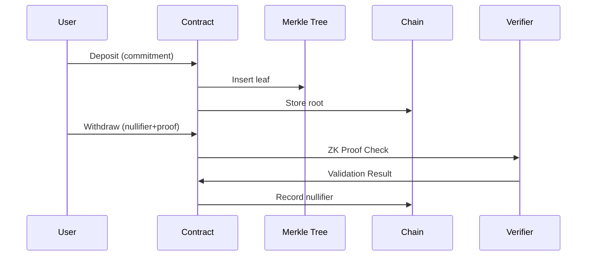

# BitCloak: Privacy Pool Protocol for Stacks L2

[](https://docs.stacks.co/docs/clarity/)

Zero-knowledge privacy protocol enabling confidential SIP-010 token transactions with Bitcoin-compliant audit capabilities on Stacks Layer 2.

## Key Features

- **ZK-SNARK-Compatible Architecture**: Privacy-preserving transactions using Merkle tree commitments
- **SIP-010 Token Standard Support**: Full compatibility with Stacks fungible tokens
- **Merkle Tree Depth 20**: Supports 1,048,576 leaves (≈$50M capacity at $50/token)
- **Regulatory Compliance Tools**:
  - Nullifier tracking for audit trails
  - Configurable deposit limits
  - Transparent root history
- **Enterprise-Grade Security**:
  - Multi-level admin controls
  - Circuit breaker pattern
  - Proof validation safeguards

## Technical Specifications

### Merkle Tree Configuration

| Parameter      | Value    | Description                 |
| -------------- | -------- | --------------------------- |
| Tree Height    | 20       | Supports 2²⁰ leaves         |
| Node Hash      | SHA-256  | Bitcoin-compatible hashing  |
| Root Update    | On-chain | Every deposit modifies root |
| Nullifier Size | 32 bytes | Prevents collision attacks  |

### System Limits

- Max Single Deposit: 1,000,000 units (configurable)
- Min Withdrawal: 1 unit
- Tree Capacity: 1,048,576 deposits

### Error Codes

| Code | Description               |
| ---- | ------------------------- |
| 1001 | Unauthorized access       |
| 1002 | Invalid amount            |
| 1003 | Insufficient balance      |
| 1004 | Invalid commitment format |
| 1005 | Nullifier reuse attempt   |

## Installation

### Prerequisites

- [Clarinet](https://docs.hiro.so/clarinet) v2.12.0+
- Node.js 18.x
- Stacks.js v6.x

```bash
git clone https://github.com/your-org/bitcloak.git
cd bitcloak
npm install
clarinet check  # Verify contract syntax
```

## Smart Contract Functions

### Core Operations

| Function                | Parameters                                  | Description                   |
| ----------------------- | ------------------------------------------- | ----------------------------- |
| `make-deposit`          | (commitment, amount, token)                 | Lock tokens into privacy pool |
| `process-withdrawal`    | (nullifier, root, proof, recipient, amount) | Withdraw funds privately      |
| `toggle-contract-pause` | None                                        | Emergency stop mechanism      |

### Admin Functions

| Function         | Parameters                 | Description             |
| ---------------- | -------------------------- | ----------------------- |
| `admin-recovery` | (token, recipient, amount) | Emergency fund recovery |

### Read-Only Functions

| Function                 | Returns                              |
| ------------------------ | ------------------------------------ |
| `get-contract-status`    | (paused, total-deposited, next-leaf) |
| `check-nullifier-status` | (used, amount, block)                |
| `get-deposit-details`    | (index, block, depositor, amount)    |

## Security Model

### Audit Trail



### Key Safeguards

1. **Circuit Breaker Pattern**: Contract owner can pause operations
2. **Nullifier Blacklist**: Prevents double-spend attacks
3. **Proof Validation**: SHA-256 Merkle verification
4. **Deposit Limits**: Configurable MAX_DEPOSIT_AMOUNT

## Compliance Features

### Audit Interface

```clarity
(define-read-only (generate-audit-report (start-block uint) (end-block uint))
  ;; Returns formatted compliance data for regulators
```

### Transparency Metrics

- Real-time deposit totals
- Historical nullifier map
- Merkle root evolution timeline

## Contributing

1. Fork repository
2. Create feature branch (`feature/[descriptor]`)
3. Submit PR with:
   - Test coverage
   - Documentation updates
   - Security analysis

---

**Warning**: This is experimental software. Use only with testnet assets until formal audits are completed.
